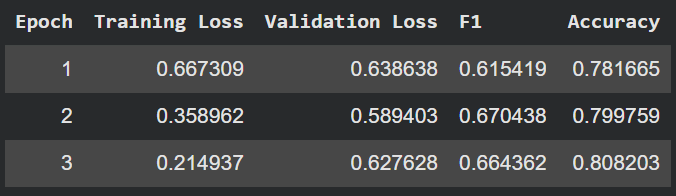
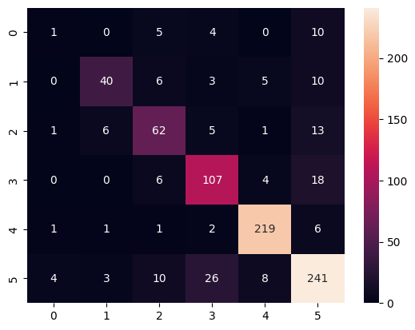
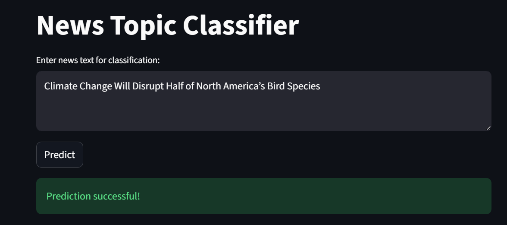
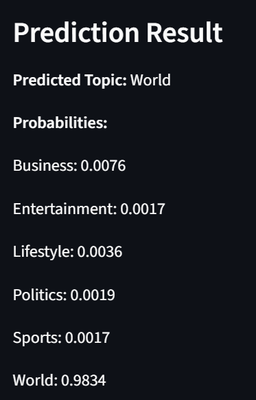
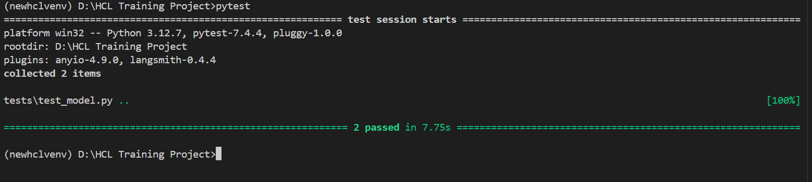

# News Headline Topic Classification using DistilBERT

A Transformer-based NLP project that automatically classifies news headlines into predefined topic categories using a fine-tuned DistilBERT model.  
The project includes data scraping, model training, testing, and deployment via Streamlit.

---

## Table of Contents

- [Problem Statement](#problem-statement)
- [Dataset](#dataset)
- [Model Architecture](#model-architecture)
- [Results](#results)
- [Web Application](#web-application)
- [Testing](#testing)
- [Installation](#installation)

---

## Problem Statement

Manual tagging of news articles is time-consuming and error-prone.  
This project aims to automate topic classification of news headlines using a Transformer-based NLP model.

---

## Dataset

- Data collected via web scraping using Selenium
- Number of samples: 4143
- Number of classes: 6
- Example classes:
  - Politics
  - Sports
  - Business
  - Technology
  - World
  - Lifestyle

### Data Preprocessing Steps

- Dropping Duplicates
- encoding with LabelEncoder
- Train-Test split (80-20)
- Tokenizer function for Truncation and Padding on Dataset
- Tokenization using DistilBERT tokenizer

---

## Model Architecture

- Base Model: distilbert-base-uncased
- Framework: Hugging Face Transformers
- Epochs: 3
- Batch Size: 16

Training conducted on:
- T4 GPU
- Google Colab

---

## Results

- Training Results

- Confusion Matrix

---

## Web Application

Built using **Streamlit**.

Features:
- User inputs a headline
- Model predicts topic
- Displays confidence scores

### App Screenshot

---

## Testing

Testing framework: `pytest`

Test coverage includes:
- Input validation on empty input
- App functionality

## Installation

git clone https://github.com/ks-chauhan/HCL-Training-Project/tree/main.git
cd news-classifier

conda create --name venv python = 3.12

pip install -r requirements.txt

streamlit run app.py

Deployment : https://news-headline-classifier.streamlit.app/